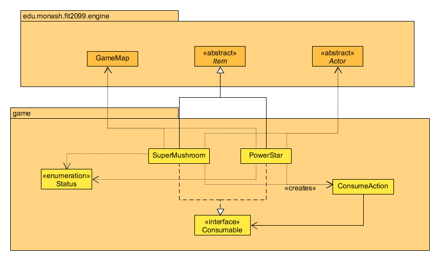
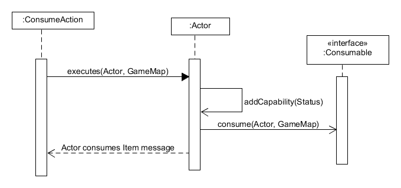
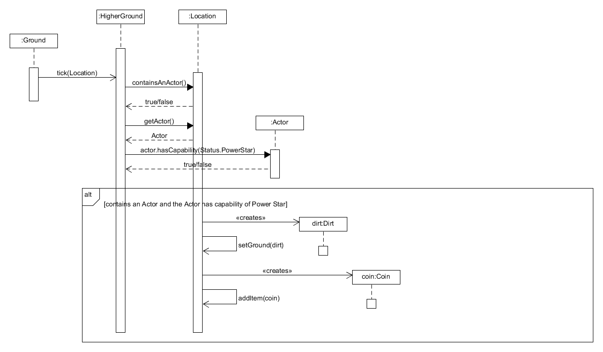

# REQ4: Magical Items :mushroom: Design Rationale

For reference, here are the class diagrams and the sequence diagrams.

## Class Diagram

## Sequence Diagram

## Rationale

The Consumable interface will have two methods that need to be implemented.

1. effect() - This will return the `Status` that consuming it will give. For
   example, consuming a SuperMushroom would give it a TALL status, so this
   would return `Status.TALL`
2. consume(Actor, GameMap) - This will execute when the item is eaten. The
   reason for having this is that we want to allow for custom code to be run
   depending on the class implementing it. For example, PowerStar not only
   inflicts a status (perhaps called a `POWER_STAR` status, or perhaps an INVINCIBLE
   status), but also heals the player. A SuperMushroom doesn't
   only inflict a status (The TALL status given in the code), but also lets you
   increase the _max_ HP, which is different from increasing just the _HP_ like
   what PowerStar does.

Note that we could just handle adding the effect of consuming the item in
consume(), but we want to make sure that all Consumables have an effect, hence
the effect() method.

A ConsumeAction was created as well to let the player eat the item. It has
an association with the Consumable that it is meant to eat.

This association with the interface follows the dependency inversion principle.
If the ConsumeAction class were to have associations instead with PowerStar
and SuperMushroom, if any other consumable were to be created, the code in
ConsumeAction would have to be updated as well, which is not ideal because we
want to minimising changing code from other classes when making such a change.

An alternate design would be to have a ConsumableItem class, that itself
derives from Item. Then, PowerStar and SuperMushroom would have to derive from
this ConsumableItem class. In fact, using this method, we can have the effect
be a protected attribute of this class instead of a method. The reason we
didn't go with this approach is because

1. It would limit the Consumables to only be Items. If we were to decide to
   have a consumable Actor in the future (Eating dead turtles and mushrooms?),
   we would have to re-design the code to account for this.
2. Allow for pseudo "multiple inheritance". Imagine if we decide to create a
   another class called Drinkable, which is similar to Consumable. So we go
   ahead and create a DrinkableItem class. Now, we decide we want to have an
   item that is _both_ drinkable and consumable, We aren't able to extend both
   classes! Perhaps the best we can do is create a class called
   ConsumableDrinkableItem and inherit from that instead, and you can see how this would get messy very
   quickly as we add other types of item classes, and not having a base type we
   can use, for example in the ConsumeAction class. This would adhere to the Interface Segregation Principle, where the
large interface of "DrinkableConsumableItem" is split into smaller ones called "ConsumableItem" and "DrinkableItem".

### Changes from Assignment 1 to Assignment 2
None.
